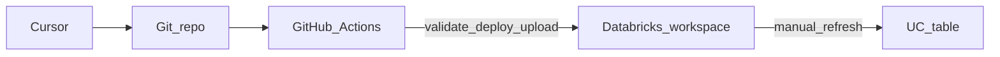

# Vibe coding + Databricks Asset Bundles + GitHub Actions

**Hands-on demo:** Lakeflow Spark Declarative Pipelines

---

## Agenda

- What vibe coding means in this session
- End-to-end flow: Cursor → workspace
- Demo goal: pipeline from volume CSV to diagnostics table
- The demo prompt and constraints
- Repo layout and what CI does
- After deploy: refresh and Q&A

---

## What is vibe coding?

- Iterative, AI-assisted development in **Cursor**
- Describe outcomes in natural language; **review and steer**
- Bundle YAML and Python evolve through conversation

---

## End-to-end flow

1. **Cursor** — Natural-language iteration on bundle and pipeline code
2. **Git repository** — `databricks.yml`, `resources/pipelines/`, `src/`
3. **GitHub Actions** — `bundle validate`, `bundle deploy`, CSV upload to volume
4. **Databricks workspace** — **Manual** pipeline refresh to materialize tables

---

## Demo goal

- **Lakeflow Spark Declarative Pipeline** (Databricks Asset Bundle)
- Load **`lab_results.csv`** into a table in the **`diagnostics`** schema
- Source file: read from **Unity Catalog volume** (CSV uploaded from `data/` by CI)

---

## The demo prompt (abbreviated)

Create a Databricks Asset Bundle pipeline from scratch for Lakeflow Spark Declarative Pipelines to load `lab_results.csv` into a table in the diagnostics schema; lab results taken from the volume.

**Full verbatim prompt:** see [README.md](../README.md) → *Session demo prompt (vibe)*.

---

## Constraints checklist

- **No** `bundle run` in CI unless explicitly requested
- **Serverless** pipeline + **Lakeflow Advanced** edition
- **Minimal:** one `@dlt.table` loading the CSV once
- **Python** `.py` file; YAML uses `libraries` **`file:`** not `notebook`
- **`file.path`** relative to **that pipeline YAML file’s directory**
- **No web search** during the demo
- **Catalog and schema names hardcoded** in code

---

## Repo layout at a glance

| Area | Role |
|------|------|
| `databricks.yml` | Bundle root |
| `resources/pipelines/` | Pipeline resource YAML |
| `src/` | Pipeline Python (paths resolve from pipeline YAML) |
| `data/` | CSV files for workflow upload |
| `.github/workflows/` | Deploy app bundle (validate, deploy, upload) |

---

## What CI does (and does not)

**Does**

- `databricks bundle validate`
- `databricks bundle deploy`
- Upload `data/*.csv` to the configured volume path

**Does not**

- Run the pipeline or `bundle run` by default

---

## After deploy

- Find the pipeline under **Jobs & Pipelines** / **Pipelines** (e.g. `diagnostics_lab_results_pipeline`)
- Confirm via **`databricks bundle summary`** and **`databricks pipelines list-pipelines`** in the workflow log
- Start a **pipeline refresh** in the workspace to materialize the table

---

## Q&A and links

- [Databricks Asset Bundles](https://docs.databricks.com/dev-tools/bundles/index.html)
- [Databricks CLI](https://docs.databricks.com/dev-tools/cli/index.html)
- [Cursor](https://cursor.com)

---

*Session notes — see root [README.md](../README.md) for setup and the full demo prompt.*
