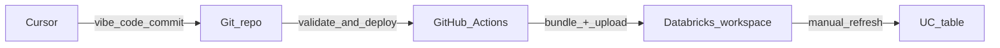

# Cursor, vibe coding, and CI/CD for Databricks ETL

**Purpose:** Use **Cursor** and **vibe coding** to build **Databricks ETL** as code, then **package** it with a **Databricks Asset Bundle** and **deploy** it through **GitHub Actions** into your workspaces.

**Through-line:** *Develop in Cursor* → *define the bundle in the repo* → *let CI validate and deploy*. The **worked example** is a small Lakeflow pipeline (CSV → table); it illustrates the path, not the main message.

---

## How this session flows

Follow this order end to end—each step hands off to the next:

1. **The three beats** — Why vibe coding, why a bundle, why GitHub Actions (one story, no repetition).
2. **The path** — Cursor → Git → Actions → workspace (diagram + what runs where).
3. **The live prompt** — What you paste into Cursor during the demo, plus constraints.
4. **The repo and CI** — Where files live, what the workflow does, what you do after deploy.
5. **Q&A** — Links and deeper setup in the root README.

---

## 1. The three beats

| Beat | Role |
|------|------|
| **Vibe coding (Cursor)** | You describe outcomes in natural language, review what the assistant generates, and steer until `databricks.yml`, `resources/`, and `src/` match your intent. The point is **iteration and review**, not a tour of Spark syntax. |
| **Databricks Asset Bundle** | The repo holds the **deployable definition**: bundle root, pipeline (or job) YAML, and Python. Same bundle, different **targets** (e.g. dev / prod)—the contract between Git and the workspace. |
| **GitHub Actions** | **Validate** and **deploy** run in CI so pushes and PRs **promote** the bundle predictably. Extra steps (e.g. uploading `data/*.csv` to a volume) **support** the pipeline; they do not replace the bundle story. |

**Worked example (glue, not the headline):** A minimal **Lakeflow Spark Declarative Pipeline** loads `lab_results.csv` from a Unity Catalog volume into a diagnostics table. It gives real paths to point at and a manual **pipeline refresh** to show in the workspace.

---

## 2. The path (end to end)

1. **Cursor** — Edit bundle and ETL code with the assistant; commit when ready.
2. **Git** — Source of truth: `databricks.yml`, `resources/pipelines/`, `src/`, etc.
3. **GitHub Actions** — `databricks bundle validate`, `databricks bundle deploy`, upload CSVs to the volume path your bundle expects.
4. **Databricks workspace** — Bundle resources appear in the workspace; you **refresh the pipeline** manually to materialize tables (unless you add automation).



---

## 3. Session demo prompt (vibe)

Paste this (or equivalent) when driving the live demo in Cursor:

```
Create a Databricks Asset Bundle pipeline from scratch for Lakeflow Spark Declarative Pipelines to load lab_results.csv into a table in the diagnostics schema. The lab result to be taken from the volume.

Constraints
No bundle run in CI unless asked.
use Serverless with advance edition
Keep code minimal: one @dlt.table that loads the CSV once.
Keep the code in py file not notebook
Make sure the yml file config uses 'file' not notebook
keep the py file and yml file in their designated directories in current folder structures.
Define the python code path in yml in so that it resolves the path relative to that YAML file's directory

don't search online
keep the catalog and schema name hardcoded
```

### Constraints (as given to the assistant)

- **No `bundle run` in CI** unless you explicitly ask for it.
- **Serverless** pipeline with **Lakeflow Advanced** edition (required for serverless pipelines).
- **Minimal code:** a single `@dlt.table` that loads the CSV once.
- **Python module (`.py`)**, not a notebook; pipeline `libraries` use **`file`**, not `notebook`, in YAML.
- **Conventional layout:** pipeline bundle YAML under `resources/pipelines/`, pipeline Python under the repo’s `src/…` layout; **`file.path`** in included YAML resolves **relative to that YAML file’s directory** (not the bundle root).
- **No web search** during the demo (assistant should not search online).
- **Catalog and schema names hardcoded** in code as specified for the demo.

---

## 4. Repo layout and what happens in CI

### Where things live

| Area | Role |
|------|------|
| `databricks.yml` | Bundle root (targets, includes) |
| `resources/pipelines/` | Pipeline resource YAML |
| `src/` | ETL / pipeline Python (`file.path` relative to the pipeline YAML) |
| `data/` | CSV files the workflow can upload |
| `.github/workflows/` | Validate, deploy, upload |

### What CI does (and does not)

**Does**

- `databricks bundle validate`
- `databricks bundle deploy`
- Upload `data/*.csv` to the configured volume path

**Does not**

- Run the pipeline or `bundle run` by default

### After deploy

- Open **Jobs & Pipelines** / **Pipelines** (e.g. `diagnostics_lab_results_pipeline`).
- Confirm from the workflow log with **`databricks bundle summary`** and **`databricks pipelines list-pipelines`**.
- Run a **pipeline refresh** in the workspace to materialize the table.

---

## Q&A and links

- [Databricks Asset Bundles](https://docs.databricks.com/dev-tools/bundles/index.html)
- [Databricks CLI](https://docs.databricks.com/dev-tools/cli/index.html)
- [Cursor](https://cursor.com)
- [POC walkthrough](vibe-coding-databricks-bundle-poc.md)

---

*Fork, local CLI, and GitHub Environment setup: root [README.md](../README.md).*
